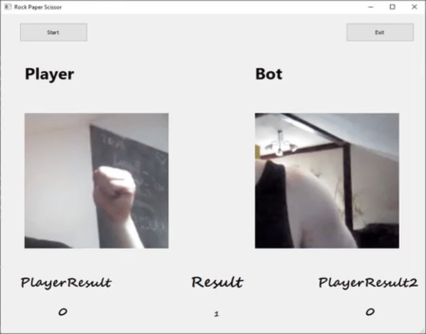

# rock-paper-scissor-neural-network
A simple app to play rock paper scissor using a camera.

Used libraries:
PyQt5,
Keras,
OpenCv

The model architecture consists of the VGG16 model and its own classifier for hand recognition.

Currently, the application only has a game with a bot, in the future it is possible to add a multiplayer game
